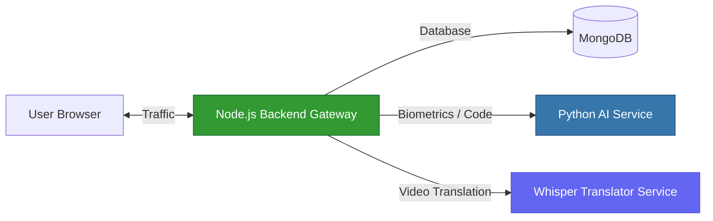
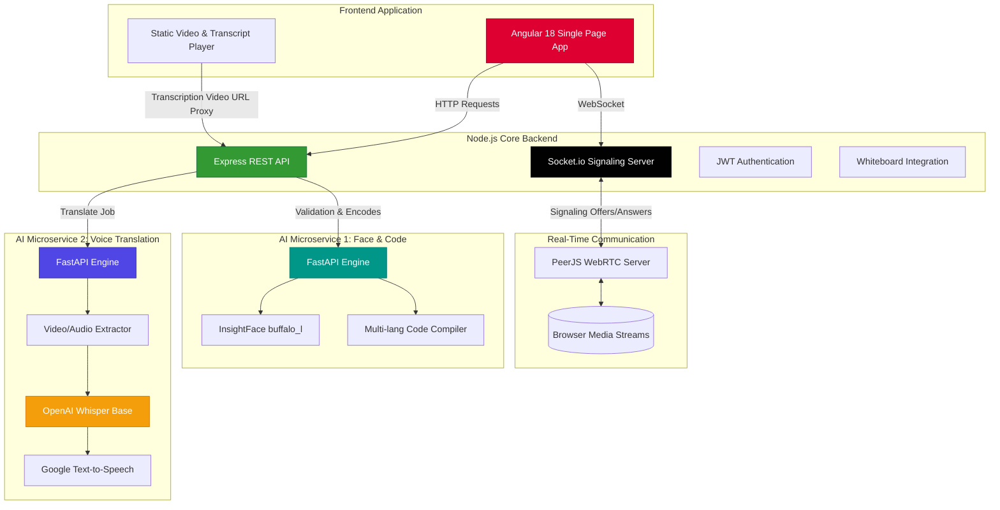

<div align="center">

# 🚀 ORBIT AI
### The Next-Generation Intelligent Educational Platform

<p>
  
  
  
  
  
  
</p>

<p>
  <strong>A microservices-driven education portal blending live synchronous teaching with asynchronous AI-powered tools.</strong>
</p>

</div>

---

## 🔗 Project Repositories

ORBIT is built using a microservices architecture. The codebase is split across several specific Git repositories for modularity and scaling:

| Module | Repository Link | Stack | Description |
|--------|----------------|-------|-------------|
| **[FRONTEND] App** | [Srikarsanka/orbit](https://github.com/Srikarsanka/orbit) | Angular, Tailwind | The client-facing Web UI for students and faculty |
| **[BACKEND] Core** | [Srikarsanka/orbitbackend](https://github.com/Srikarsanka/orbitbackend) | Node.js, Express, Mongo | Core API, Video Call Signaling, WebRTC endpoints |
| **[AI] Face & Exec** | [Srikarsanka/pythonfacerecognizationorbit](https://github.com/Srikarsanka/pythonfacerecognizationorbit) | Python, FastAPI | Face Recognition biometric logins & Code Compilation |
| **[AI] Translator** | [Srikarsanka/orbittranslate](https://github.com/Srikarsanka/orbittranslate) | Python, Whisper, FFmpeg | AI Audio extraction and Multi-language Translation |
| **[ROOT] System** | [Srikarsanka/orbitai](https://github.com/Srikarsanka/orbitai) | Markdown, Configs | Master repository connecting global architecture docs |

---

## 🏗️ Architecture: Simple Overview

At a high level, ORBIT connects users to a central Node.js gateway that handles database reading, live class connections, and routing to specialized AI Python engines.



---

## 🏗️ Architecture: In-Depth Technical Flow



---

## 🛠️ Global Commands & Setup

Because ORBIT uses multiple repositories and microservices, starting the entire environment locally requires running the specific services.

### 1️⃣ Clone All Repositories
Since the system is decoupled, clone them into a central `ORBIT` folder:

```bash
mkdir ORBIT && cd ORBIT
git clone https://github.com/Srikarsanka/orbit.git frontend
git clone https://github.com/Srikarsanka/orbitbackend.git backend
git clone https://github.com/Srikarsanka/pythonfacerecognizationorbit.git backend/python
git clone https://github.com/Srikarsanka/orbittranslate.git backend/voice_translation
```

### 2️⃣ Start The Core Backend (Gateway)
```bash
cd backend
npm install
npm run dev
# Starts on http://localhost:5000
```

### 3️⃣ Start the Frontend Web App
```bash
cd frontend
npm install
ng serve
# Starts on http://localhost:4200
```

### 4️⃣ Start Python AI & Code Execution Service
```bash
cd backend/python
python -m venv venv
source venv/bin/activate
pip install -r requirements.txt
uvicorn app:app --host 0.0.0.0 --port 8000 --reload
# Starts on http://localhost:8000
```

### 5️⃣ Start Voice Translation Docker Service
```bash
cd backend/voice_translation
docker build -t orbit-voice-translation .
docker run -d --name orbit-vt -p 8001:8001 orbit-voice-translation
# Starts on http://localhost:8001
```

---

<div align="center">

### Built strategically to scale from classrooms to global learning.

</div>
