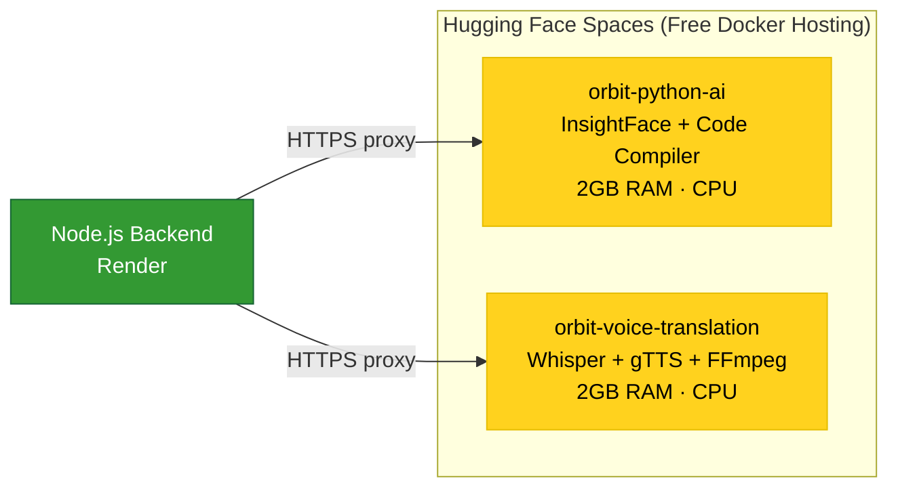
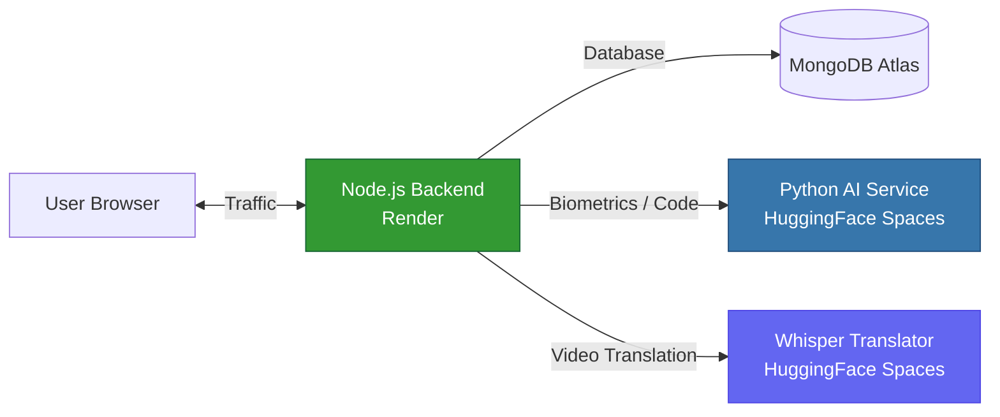
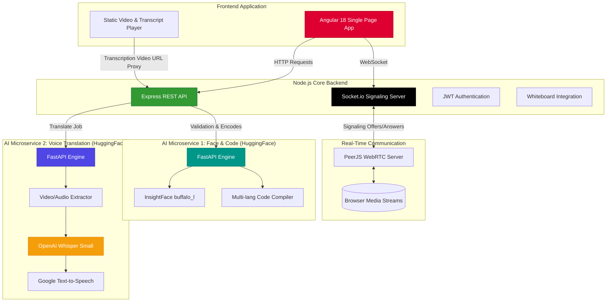

<div align="center">

# 🚀 ORBIT AI
### The Next-Generation Intelligent Educational Platform

<p>
  
  
  
  
  
  
</p>

<p>
  <strong>A microservices-driven education portal blending live synchronous teaching with asynchronous AI-powered tools.</strong>
</p>

</div>

---

## 🔗 Project Repositories

ORBIT is built using a microservices architecture. The codebase is split across several specific Git repositories for modularity and scaling:

| Module | Repository Link | Stack | Description |
|--------|----------------|-------|-------------|
| **[FRONTEND] App** | [Srikarsanka/orbit](https://github.com/Srikarsanka/orbit) | Angular, Tailwind | The client-facing Web UI for students and faculty |
| **[BACKEND] Core** | [Srikarsanka/orbitbackend](https://github.com/Srikarsanka/orbitbackend) | Node.js, Express, Mongo | Core API, Video Call Signaling, WebRTC endpoints |
| **[AI] Face & Exec** | [Srikarsanka/pythonfacerecgroinzationorbit](https://github.com/Srikarsanka/pythonfacerecgroinzationorbit) | Python, FastAPI | Face Recognition biometric logins & Code Compilation |
| **[AI] Translator** | [Srikarsanka/orbittranslate](https://github.com/Srikarsanka/orbittranslate) | Python, Whisper, FFmpeg | AI Audio extraction and Multi-language Translation |
| **[ROOT] System** | [Srikarsanka/orbitai](https://github.com/Srikarsanka/orbitai) | Markdown, Configs | Master repository connecting global architecture docs |

---

## ☁️ Live Deployment URLs

| Service | Platform | URL |
|---------|----------|-----|
| **Frontend** | Vercel | [`https://orbit-pgd9.vercel.app`](https://orbit-pgd9.vercel.app) |
| **Backend API** | Render | [`https://orbitbackend-0i66.onrender.com`](https://orbitbackend-0i66.onrender.com) |
| **Python AI** | HuggingFace Spaces | [`https://srikar048-orbit-python-ai.hf.space`](https://srikar048-orbit-python-ai.hf.space) |
| **Voice Translation** | HuggingFace Spaces | [`https://srikar048-orbit-voice-translation.hf.space`](https://srikar048-orbit-voice-translation.hf.space) |

---

## 🤗 Why Hugging Face Spaces?

[**Hugging Face Spaces**](https://huggingface.co/docs/hub/spaces) is a platform by Hugging Face (the world's largest AI/ML community) that lets developers deploy machine learning applications for free using Docker containers, Gradio, or Streamlit.

### Why ORBIT Uses It for AI Microservices

ORBIT's Python AI and Voice Translation services are **heavy ML workloads** — InsightFace loads a 280MB face recognition model into memory, and Whisper loads a 460MB speech recognition model. These require **2GB+ RAM**, which exceeds the free tier limits of traditional cloud platforms like Render (512MB) and Heroku (512MB).

| Challenge | Traditional PaaS (Render/Heroku) | Hugging Face Spaces |
|-----------|----------------------------------|---------------------|
| **RAM for ML models** | 512MB free tier → OOM crash | **16GB free tier** → loads easily |
| **Docker support** | Paid plans only | **Free Docker containers** |
| **Cold start** | Varies | Models pre-loaded at build time |
| **GPU access** | Not available on free tier | Available (paid) for faster inference |
| **Cost** | $7-25/month per service | **Completely free** for CPU workloads |
| **No credit card** | Required for most providers | **Not required** |

### How It Works in ORBIT


```mermaid
graph LR
    subgraph "Hugging Face Spaces (Free Docker Hosting)"
        HF1["orbit-python-ai<br/>InsightFace + Code Compiler<br/>2GB RAM · CPU"]
        HF2["orbit-voice-translation<br/>Whisper + gTTS + FFmpeg<br/>2GB RAM · CPU"]
    end

    BE["Node.js Backend<br/>Render"] -->|"HTTPS proxy"| HF1
    BE -->|"HTTPS proxy"| HF2
    
    style HF1 fill:#FFD21E,color:#000,stroke:#E5BD00
    style HF2 fill:#FFD21E,color:#000,stroke:#E5BD00
    style BE fill:#339933,color:#fff,stroke:#166534
```

Each Space runs as an independent Docker container with its own URL (`*.hf.space`). The Node.js backend on Render proxies API requests to these Spaces, keeping the architecture decoupled and scalable.

> **Key Benefit:** By separating ML-heavy workloads into Hugging Face Spaces, the Node.js backend stays lightweight on Render's free tier, while the AI services get the 2GB+ RAM they need — all at zero cost.

---

## 🏗️ Architecture: Simple Overview

At a high level, ORBIT connects users to a central Node.js gateway that handles database reading, live class connections, and routing to specialized AI Python engines.


```mermaid
graph LR
    User["User Browser"] <-->|"Traffic"| Gateway["Node.js Backend<br/>Render"]
    
    Gateway -->|"Database"| DB[("MongoDB Atlas")]
    Gateway -->|"Biometrics / Code"| AI1["Python AI Service<br/>HuggingFace Spaces"]
    Gateway -->|"Video Translation"| AI2["Whisper Translator<br/>HuggingFace Spaces"]
    
    style Gateway fill:#339933,color:#fff,stroke:#166534
    style AI1 fill:#3776ab,color:#fff,stroke:#1f4c7a
    style AI2 fill:#6366f1,color:#fff,stroke:#4f46e5
```

---

## 🏗️ Architecture: In-Depth Technical Flow


```mermaid
graph TD
    subgraph Frontend Application
        UI["Angular 18 Single Page App"]
        VPlayer["Static Video & Transcript Player"]
    end

    subgraph Node.js Core Backend
        API["Express REST API"]
        Socket["Socket.io Signaling Server"]
        Auth["JWT Authentication"]
        WBO["Whiteboard Integration"]
    end
    
    subgraph Real-Time Communication
        PeerJS["PeerJS WebRTC Server"]
        Media[("Browser Media Streams")]
    end

    subgraph "AI Microservice 1: Face & Code (HuggingFace)"
        FastAPI_1["FastAPI Engine"]
        InsightFace["InsightFace buffalo_l"]
        Exec["Multi-lang Code Compiler"]
    end

    subgraph "AI Microservice 2: Voice Translation (HuggingFace)"
        FastAPI_2["FastAPI Engine"]
        FFmpeg["Video/Audio Extractor"]
        Whisper["OpenAI Whisper Small"]
        GTTS["Google Text-to-Speech"]
    end

    %% Connections
    UI -->|"HTTP Requests"| API
    UI -->|"WebSocket"| Socket
    Socket <-->|"Signaling Offers/Answers"| PeerJS
    PeerJS <--> Media
    
    API -->|"Validation & Encodes"| FastAPI_1
    FastAPI_1 --> InsightFace
    FastAPI_1 --> Exec
    
    VPlayer -->|"Transcription Video URL Proxy"| API
    API -->|"Translate Job"| FastAPI_2
    FastAPI_2 --> FFmpeg
    FFmpeg --> Whisper --> GTTS
    
    %% Styling
    style UI fill:#dd0031,color:#fff,stroke:#990022
    style API fill:#339933,color:#fff,stroke:#166534
    style Socket fill:#010101,color:#fff,stroke:#000
    style FastAPI_1 fill:#009688,color:#fff,stroke:#00796b
    style FastAPI_2 fill:#4f46e5,color:#fff,stroke:#3730a3
    style Whisper fill:#f59e0b,color:#fff,stroke:#d97706
```

---

## 🛠️ Global Commands & Setup

Because ORBIT uses multiple repositories and microservices, starting the entire environment locally requires running the specific services.

### 1️⃣ Clone All Repositories
Since the system is decoupled, clone them into a central `ORBIT` folder:

```bash
mkdir ORBIT && cd ORBIT
git clone https://github.com/Srikarsanka/orbit.git frontend
git clone https://github.com/Srikarsanka/orbitbackend.git backend
git clone https://github.com/Srikarsanka/pythonfacerecgroinzationorbit.git backend/python
git clone https://github.com/Srikarsanka/orbittranslate.git backend/voice_translation
```

### 2️⃣ Start The Core Backend (Gateway)
```bash
cd backend
npm install
npm run dev
# Starts on http://localhost:5000
```

### 3️⃣ Start the Frontend Web App
```bash
cd frontend
npm install
ng serve
# Starts on http://localhost:4200
```

### 4️⃣ Start Python AI & Code Execution Service
```bash
cd backend/python
python -m venv venv
source venv/bin/activate
pip install -r requirements.txt
uvicorn app:app --host 0.0.0.0 --port 8000 --reload
# Starts on http://localhost:8000
```

### 5️⃣ Start Voice Translation Docker Service
```bash
cd backend/voice_translation
docker build -t orbit-voice-translation .
docker run -d --name orbit-vt -p 8001:8001 orbit-voice-translation
# Starts on http://localhost:8001
```

---

<div align="center">

### Built strategically to scale from classrooms to global learning.

</div>
