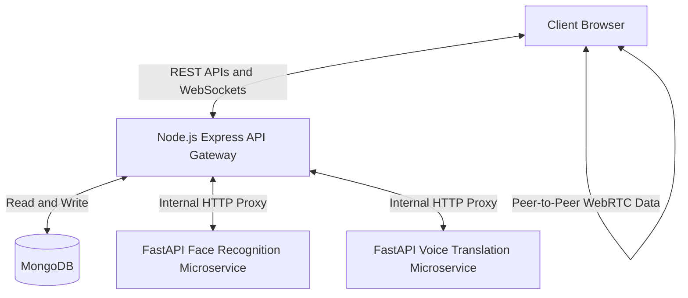
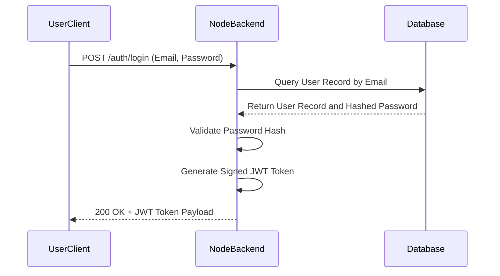
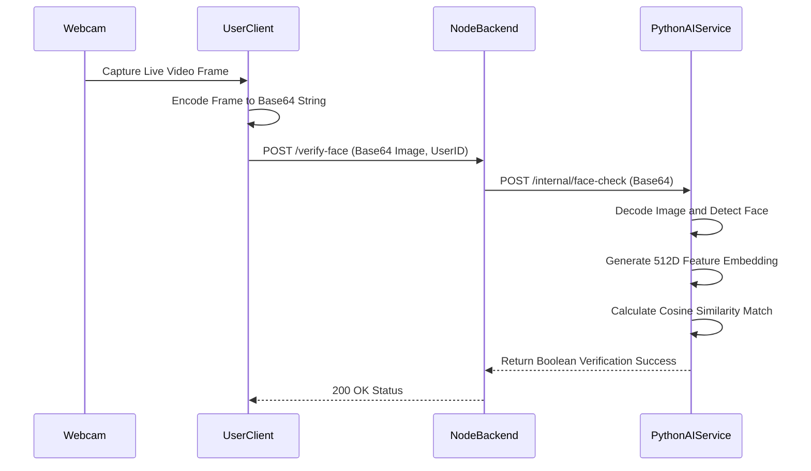
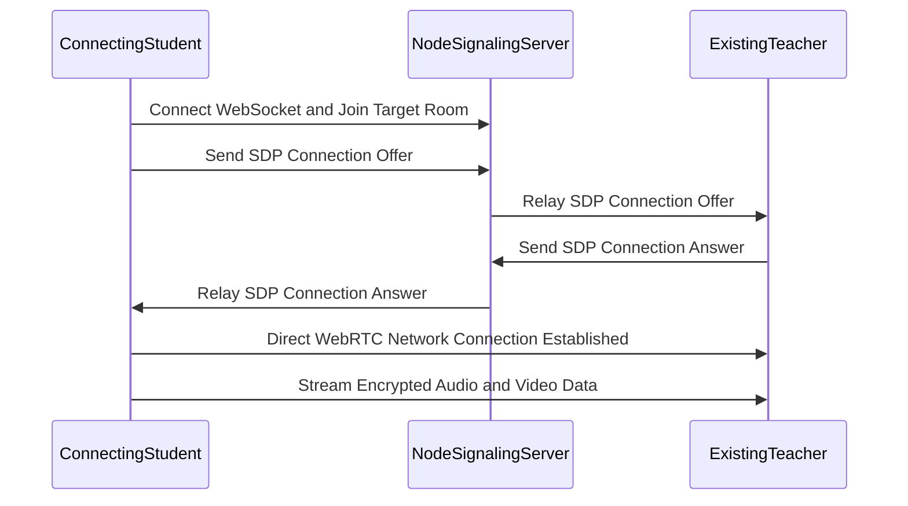
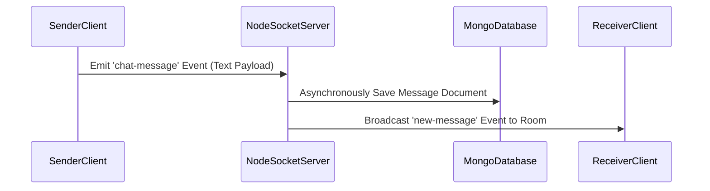
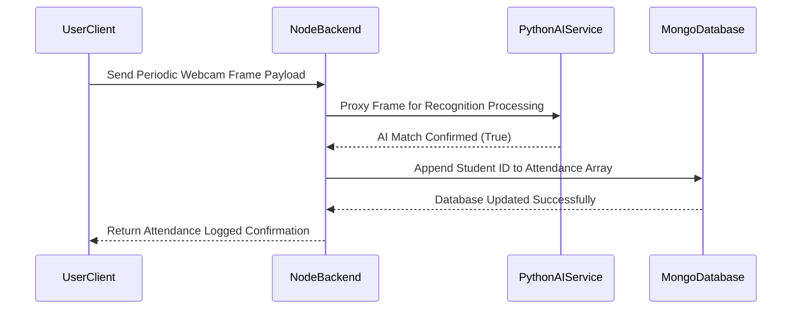
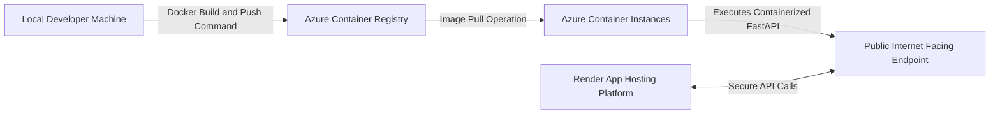

# Virtual Classroom Architecture and Interview Guide

## Project Introduction

The Virtual Classroom is a comprehensive, microservices-based educational platform designed to replicate and enhance the physical learning experience in a digital environment. The project solves critical challenges in online education, such as manual attendance tracking, lack of engagement oversight, and limited accessibility for recorded lectures. It achieves this by integrating real-time peer-to-peer video communication, artificial intelligence for automated biometric attendance, and automated speech-to-text processing for lecture transcription.

## Technology Stack

| Technology | Role | Selection Justification |
|---|---|---|
| Angular | Frontend Framework | Provides a robust component-based architecture and strict TypeScript typing necessary for managing complex, stateful single-page applications. |
| Node.js & Express | Core API Gateway | Offers an asynchronous, event-driven architecture that is highly efficient at managing thousands of concurrent WebSocket connections. |
| FastAPI | Python AI Microservices | Delivers high-performance, native asynchronous Python execution, ideal for non-blocking heavy computational AI and machine learning tasks. |
| MongoDB | Primary Database | Flexible NoSQL schema design allows for agile storage of varied user data, complex class schedules, and unstructured chat records. |
| WebRTC & PeerJS | Video and Audio Transmission | The industry standard for peer-to-peer communication, offering sub-second latency. PeerJS abstracts the complex signaling setup. |
| Socket.io | Real-time Messaging | Provides persistent, bidirectional event-based communication ensuring instant chat propagation with built-in fallback protocols. |
| InsightFace | Face Recognition AI | A state-of-the-art deep learning model providing highly accurate facial feature extraction optimized for varying webcam environments. |
| OpenAI Whisper | Speech-to-Text AI | A powerful sequence-to-sequence transformer model robust to diverse accents, generating highly accurate multi-language transcripts. |
| Docker | Containerization | Packages AI environments and complex system dependencies to ensure absolute consistency from local development to production. |
| Azure Container Instances | Cloud Hosting | Provides scalable on-demand compute resources to run containerized machine learning models without virtual machine maintenance overhead. |

## High Level Architecture

### Technical Explanation
The system employs a distributed microservices pattern to separate the high-concurrency web server layer from the CPU-intensive artificial intelligence workloads. The Angular frontend communicates exclusively with the Node.js API gateway. The gateway either resolves the request by querying the MongoDB database or acts as a reverse proxy, forwarding heavy computational tasks to the specialized Python FastAPI microservices. Real-time media streams bypass the backend entirely, flowing directly between client browsers via WebRTC to minimize latency and server bandwidth consumption.

### Simple Explanation
Imagine a busy restaurant. The customer (Frontend) gives their order to the waiter (Node.js Gateway). For a simple request like a drink, the waiter grabs it from the fridge (Database) and hands it back. For a complex, cooked meal, the waiter hands the order ticket to a specialized chef (Python Microservices). While the chef cooks, the customers at the table can talk directly to each other without needing the waiter to pass their messages (WebRTC Peer-to-Peer).

## Microservices Architecture

### Authentication Service

<kbd>What the service does</kbd> Validates user credentials and issues secure, stateless session tokens.

<kbd>How requests reach the service</kbd> The frontend submits an HTTP POST request containing email and password payloads to the Node.js gateway.

<kbd>How the service processes the request internally</kbd> The gateway queries MongoDB for the user record, verifies the provided password against a stored bcrypt hash, and generates a JSON Web Token (JWT) signed with a cryptographic secret key.

<kbd>How the service communicates with other services</kbd> It operates entirely within the Node.js gateway and the database, returning the JWT directly to the requesting client.

> [!IMPORTANT]
> **Technical Explanation**
> Authentication relies on stateless JSON Web Tokens to authorize users. The server authenticates credentials against the database and signs a JWT containing the user ID and role authorization level. Custom Express middleware intercepts all subsequent protected API requests, verifying the JWT signature located in the HTTP Authorization header. This grants robust access control without requiring the server to maintain session states in memory.

> [!TIP]
> **Simple Explanation**
> Think of logging in like getting a wristband at a concert. You show your ID at the front door to prove who you are. The staff checks the guest list and gives you an unforgeable wristband (the JWT). For the rest of the night, whenever you want to enter a VIP room, you just show the wristband. The security guards do not need to check your ID again.

### Real Time Signaling Service

<kbd>What the service does</kbd> Facilitates the initial connection handshake between browsers to establish direct video calls.

<kbd>How requests reach the service</kbd> Clients connect via WebSockets directly to the Node.js server using the PeerJS library.

<kbd>How the service processes the request internally</kbd> The service holds WebSocket connections in memory and routes specific connection metadata between two precise clients attempting to establish a call.

<kbd>How the service communicates with other services</kbd> It acts strictly as an intermediary message broker between two frontend client applications.

> [!IMPORTANT]
> **Technical Explanation**
> WebRTC requires clients to exchange public routing information and media capabilities before they can form a peer-to-peer mesh. The Node.js signaling server holds WebSocket connections and acts as a central mailbox. When Client A initiates a call to Client B, it generates a Session Description Protocol (SDP) offer. The signaling server receives this offer and pushes it to Client B. Once the SDP answer and Interactive Connectivity Establishment (ICE) candidates are exchanged through the server, the direct peer-to-peer media connection forms.

> [!TIP]
> **Simple Explanation**
> Imagine two people wanting to mail letters directly to each other's houses, but they do not know the addresses. The Signaling Service is the phone book operator. Person A calls the operator and says, "Tell Person B my address." The operator relays the message. Once both people have the addresses, they can mail each other directly and hang up the phone.

### Face Recognition Microservice

<kbd>What the service does</kbd> Verifies a student's physical identity strictly from a live webcam frame.

<kbd>How requests reach the service</kbd> The Node.js server acts as a proxy, forwarding a base64 encoded image to the Python FastAPI endpoint via an internal HTTP request.

<kbd>How the service processes the request internally</kbd> The microservice decodes the image, runs the InsightFace model to detect a face, extracts a mathematical vector representation, and computes a similarity score against stored vectors.

<kbd>How the service communicates with other services</kbd> It returns a structured JSON response containing a boolean verification result back to the Node.js server.

> [!IMPORTANT]
> **Technical Explanation**
> The microservice accepts a base64 JPEG payload and converts it into a numpy matrix. It passes this matrix through an InsightFace deep learning model. The model calculates a 512-dimensional continuous feature embedding map of the face. This new vector is compared to the student's baseline vector, stored during initial registration, using cosine distance calculations. A similarity score exceeding a defined mathematical threshold returns a successful verification boolean.

> [!TIP]
> **Simple Explanation**
> Imagine a highly advanced bouncer. Instead of looking at a photo ID, the bouncer takes a measuring tape and measures the exact distance between your eyes, nose, and mouth. He checks these current measurements against the measurements he took on your very first day of school. If the geometric numbers match closely, he lets you into the classroom.

### Speech Processing Microservice

<kbd>What the service does</kbd> Converts recorded educational video audio into highly accurate, multi-language text transcripts.

<kbd>How requests reach the service</kbd> The Node.js gateway sends the URL of a saved video file to the FastAPI endpoint via HTTP POST.

<kbd>How the service processes the request internally</kbd> The service utilizes FFmpeg to extract and format the audio track, processes it through the Whisper AI model to generate English text, and utilizes translation APIs for specific target languages.

<kbd>How the service communicates with other services</kbd> It returns a JSON array of transcript segments mapped to specific timecodes back to Node.js for database storage.

> [!IMPORTANT]
> **Technical Explanation**
> This is a multi-stage pipeline where FFmpeg demuxes the video file container into a 16kHz mono WAV format, optimized precisely for the OpenAI Whisper transformer model. Whisper maps the audio waveform sequence to text tokens. The resulting text segments are tagged with precise timestamps and optionally passed through external translation layers before being returned as a structured JSON object to the main backend.

> [!TIP]
> **Simple Explanation**
> After a class recording is saved, we only need the sound to understand the words. We use a media tool to strip away the video footage and keep only the audio. We hand this audio tape to our AI listener. The AI listens to the tape thirty seconds at a time, types out every single word it hears on a digital notepad, and writes down the exact clock time it heard each word, allowing us to show perfectly timed subtitles later.

### Chat Messaging Service

<kbd>What the service does</kbd> Delivers text messages instantly to all participants currently within a live class session.

<kbd>How requests reach the service</kbd> Messages are emitted from the browser client to the Node.js server over an active Socket.io WebSocket connection.

<kbd>How the service processes the request internally</kbd> Socket.io identifies the specific virtual room corresponding to the class ID and broadcasts the payload strictly to all other connected sockets inside that room.

<kbd>How the service communicates with other services</kbd> It communicates asynchronously with MongoDB to persist the message history while forwarding the live data to clients.

> [!IMPORTANT]
> **Technical Explanation**
> Utilizing full-duplex TCP connections via WebSockets, clients push event-driven messages to the Node.js server. The server groups individual socket connection objects into virtual network rooms mapped to the class ID. When a chat message event is received, the server executes a broadcast function, pushing the data payload to all subscribed clients with millisecond latency, simultaneously executing an asynchronous save query to MongoDB.

> [!TIP]
> **Simple Explanation**
> It operates exactly like a group chat on a walkie-talkie channel. Everyone in the classroom switches their radio to channel five. When a student presses the button and speaks, everyone tuned into channel five hears it instantly. The server acts as a radio tower ensuring the signal reaches everyone on that specific channel without crossing over into other channels.

### Video Communication Service

<kbd>What the service does</kbd> Handles the high-bandwidth transmission of live webcam and microphone data.

<kbd>How requests reach the service</kbd> The stream is initiated by the browser hardware API and routed via the PeerJS connection instance.

<kbd>How the service processes the request internally</kbd> It is handled entirely by the browser's internal WebRTC engine, which encodes the media and adjusts resolution and bitrate dynamically based on current network constraints.

<kbd>How the service communicates with other services</kbd> It communicates directly with other peer browsers across the internet, actively bypassing the Node.js backend servers.

> [!IMPORTANT]
> **Technical Explanation**
> The actual media transport occurs over UDP via the Secure Real-time Transport Protocol (SRTP) between peer network connections established by WebRTC. The browsers utilize built-in codecs, such as VP8 or H.264, to compress and encode the video stream, automatically adapting the output bitrate in response to packet loss network metrics. It operates completely client-side.

> [!TIP]
> **Simple Explanation**
> Imagine two walkie-talkies. Once they are tuned to the exact same frequency, they do not need a cell phone tower or a server in the middle to operate. The radio waves travel straight through the air from one walkie-talkie to the other. Our video streams transport data in the exact same manner across the internet, connecting computers directly to one another.

## API Flow Diagrams

### User Login Flow

### Face Verification Flow

### Joining a Classroom Flow

### Chat Messaging Flow

### Attendance Recording Flow

## Face Recognition Attendance System

> [!IMPORTANT]
> **Technical Explanation**
> The automated attendance mechanism initiates on the client-side by extracting a snapshot from the user media video track. The frame is drawn onto a hidden HTML5 canvas, compressed into a base64 JPEG string, and sent to the Node.js API. The API non-blockingly routes this to the FastAPI Python service. Inside the Python environment, the image is decoded into a numpy array. The InsightFace deep learning framework processes the image matrix. First, an object detection subnet isolates the face bounding box geometry. Second, a feature extraction subnet projects the facial geometry into a continuous 512-dimensional vector space known as an embedding. This live embedding is evaluated against the pre-enrolled embedding stored in the database utilizing Cosine Similarity, which interprets the angle between the two high-dimensional vectors. A similarity score approaching unity indicates identical identity. Upon meeting the strict threshold, the Node.js server appends the student identifier and server timestamp to the MongoDB attendance record.

> [!TIP]
> **Simple Explanation**
> When you enter the digital class, your computer takes a quick snapshot of you and sends it to a smart artificial intelligence system. The AI does not look at your eyes or hair like a human would; instead, it translates the spacing of your facial features into a very long, complex mathematical secret password. It then checks this new mathematical password against the one it saved generated on your first day of school. If the numbers match perfectly, the system automatically marks a checkmark next to your name on the teacher's attendance sheet without interrupting the class.

## Real Time Communication Architecture

> [!IMPORTANT]
> **Technical Explanation**
> WebRTC establishes direct Peer-to-Peer connections utilizing UDP transport protocols. Traditional video streaming heavily relies on a client-server model over HTTP, which introduces significant latency as network packets must travel to a central backend hub before distribution. To bypass the central server, WebRTC requires signaling procedures to traverse NAT firewalls. The architecture utilizes PeerJS interacting with Node.js to act as this signaling server. Browsers act as ICE agents, querying a public STUN server to discover their own public routing IPs. They encapsulate this routing data and media codec capabilities into SDP payloads, exchange them exclusively via the Node.js server, and punch a direct network tunnel through the firewall. Once established, the server steps aside entirely, and Secure Real-time Transport Protocol packets flow locally and directly between the client machines, resulting in sub-second latency.

> [!TIP]
> **Simple Explanation**
> Normally, if you want to send a video to someone online, you upload it to a company server, and the other person downloads it from that same server, which is slow. Peer-to-peer architecture means drawing a direct, invisible wire from your computer straight to your friend's computer. The Signaling Server simply acts as a map to help you locate your friend's house. Once you locate the house and plug in the direct wire, you talk directly over that wire, making the video call instant and private.

## Speech to Text Processing

> [!IMPORTANT]
> **Technical Explanation**
> The Whisper API integration provides automated transcription workflows. Following the conclusion of a class and the saving of the MP4 binary stream to storage, the Node.js server pushes a processing trigger to the FastAPI queue. The Python service invokes FFmpeg via a shell sub-process to demux the video container, extracting the AAC audio track and resampling it down to a 16kHz mono WAV format, which is the strict prerequisite format for the Whisper Transformer model. Whisper processes the acoustic data in thirty-second audio windows, computing log-Mel spectrograms and mapping them through neural attention heads to accurately predict subsequent text tokens. The system aggregates these textual tokens alongside their dynamically detected timestamps, returning a contiguous JSON map of transcript segments to the frontend user interface.

> [!TIP]
> **Simple Explanation**
> After a classroom recording is securely saved, the system does not need the visual video picture to understand the spoken words, it only requires the audio. We utilize a media utility tool to strip away the video layers and preserve only the raw audio track. We deliver this audio track to our AI listening system named Whisper. Whisper listens to the track in short thirty-second bursts and types out every single word it comprehends onto a digital notepad, meticulously noting the exact clock time it heard each word, allowing the platform to display perfectly synchronized subtitles.

## Deployment Architecture

> [!IMPORTANT]
> **Technical Explanation**
> The software platform heavily relies on Docker containerization to decouple the application logic from the host operating system constraints. Docker builds an immutable snapshot of the application code, the Python 3.10 runtime environment, crucial system binaries like FFmpeg, and machine learning libraries via a configuration Dockerfile. This compiled image is pushed to the Azure Container Registry. Azure Container Instances pull this remote image and allocate isolated CPU and RAM hardware resources to execute it on a managed Linux kernel. This architectural approach abstracts away the intense management of virtual machine networking, allowing the FastAPI container to run identically and scale reliably based strictly on mathematical workloads without managing underlying operating system drift.

> [!TIP]
> **Simple Explanation**
> Imagine trying to bake an incredibly complex cake, but every kitchen house you visit has a completely different oven, different cooking pans, and different measuring cups. Your recipe might fail in a different kitchen. Docker acts as a magical, sealed box. You put your exact personal oven, specific pans, measured ingredients, and recipe into the box. You ship the sealed box to Azure cloud facilities. Azure simply plugs your box into the wall, and the exact same perfectly baked cake comes out every single time without anyone having to understand or modify the local kitchen.

## System Design Discussion

Scalability and concurrency challenges are meticulously addressed through the strict separation of concerns via the microservices architecture. Node.js is uniquely and exceptionally suited for maintaining thousands of concurrent idle WebSocket connections due to its single-threaded, asynchronous Event Loop design. However, executing a synchronous deep learning matrix multiplication script directly inside Node.js would completely block the entire Event Loop, catastrophically freezing the web server for all other connected users. By appropriately offloading the Face Recognition and Audio Transcription responsibilities strictly to Python FastAPI, a language ecosystem native to data science methodologies, the system maintains robust high availability. The Python FastAPI containers can be independently scaled horizontally on Azure infrastructure based strictly on CPU processing demand without needing to spin up unnecessary Node.js WebSocket routing servers, drastically optimizing cloud infrastructure expenditures and improving system resilience.

## Interview Preparation

**Explain how WebRTC differs from traditional streaming.**
**Answer:** Traditional internet video streaming methods utilize HTTP and a strict client-server architecture where media is encoded, chunked, buffered on a central backend server, and subsequently downloaded by the client browser. This introduces inherent latency. WebRTC operates over User Datagram Protocol, specifically prioritizing rapid transmission speed over guaranteed packet delivery. By connecting directly peer-to-peer and circumventing the central server intermediate processing step entirely, WebRTC achieves the critical sub-second latency required for live, synchronous bidirectional conversations.

**What is Peer-to-Peer communication and how are connections established?**
**Answer:** Peer-to-Peer communication architectures transmit data directly from one client machine to another client machine without routing the payload through a central application backend server. Because standard browsers cannot easily locate each other on the open internet due to Network Address Translation firewalls, initial connections are established by pinging a public STUN server to discover their own public IP routing metrics. Clients package this routing data and media formats into SDP payloads and exchange them through a central Node.js Signaling Server. Once the signaling metadata is successfully swapped between peers, the direct network tunnel is established and the server steps away.

**Why use FastAPI for the AI microservices?**
**Answer:** FastAPI is exceptionally performant because it leverages modern asynchronous Python capabilities. Complex machine learning models like InsightFace are natively built in Python utilizing highly optimized C++ mathematical bindings. Attempting to execute these models natively within Node.js would require highly inefficient adapters. FastAPI provides a lightning-fast, lightweight REST network routing layer directly on top of the native AI execution environment, allowing the AI model to be exposed safely and efficiently as an independent network microservice.

**How do Face Recognition systems process images for verification?**
**Answer:** Facial recognition AI does not match raw image pixels directly. The system utilizes deep Convolutional Neural Networks. First, a detection model parses the image to identify the bounding box location of a human face. Second, a feature extraction model projects the spatial geometric measurements of the facial landmarks into a high-dimensional mathematical vector array. Verification occurs mathematically by calculating the Cosine Similarity or Euclidean distance between the newly generated live vector array and a trusted database baseline vector array.

**What problem does Docker deployment solve?**
**Answer:** Docker engineered to solve environmental inconsistency across machines. Complex artificial intelligence applications require specific system-level binaries and compiler tools that conflict easily on different operating systems software. Docker expertly packages the operational code, the required runtime environment, the exact system libraries, and the local configurations into one isolated, sealed container image. This guarantees that the software will execute identically on a developer laptop, a testing machine, and a cloud production server.

**Explain the role of Socket.io in a Real Time Communication System.**
**Answer:** While WebRTC handles the heavy data lifting of video streams, a virtual classroom mandates a highly reliable, synchronized communication channel for text chat messages and peer signaling. Socket.io provides a robust WebSockets implementation over Transmission Control Protocol, ensuring the connection remains continuously open for persistent, bidirectional communication. It wraps the native WebSocket APIs to provide valuable connection fallbacks, automatic reconnections, and broadcasting capabilities, making it technically trivial to precisely emit an event payload from one user to an entire target room of students simultaneously.

