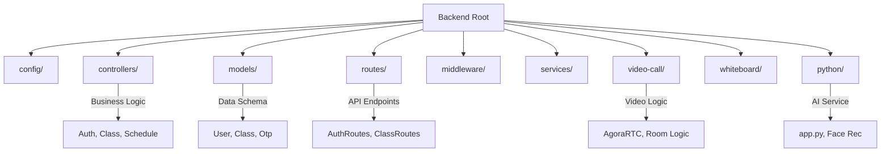

# Backend Overview

## 1. Introduction
The ORBIT backend is a robust, scalable Node.js application built with Express.js. It serves as the core processing unit for the platform, handling authentication, real-time communication, data persistence, and AI integration.

## 2. Tech Stack

- Runtime: Node.js
- Framework: Express.js
- Database: MongoDB (via Mongoose)
- Real-time Engine: Socket.io
- Video Communication: Agora SDK
- AI Services: Python (FastAPI), InsightFace, Google Gemini
- Authentication: JWT (JSON Web Tokens), BCrypt

## 3. Folder Structure Architecture

## 4. Entry Point Workflow (`server.js`)
The `server.js` file is the central entry point. It initializes:
1.  **Express App**: Middleware (CORS, BodyParser).
2.  **Database Connection**: Connects to MongoDB.
3.  **Routes**: Mounts all API routes (`/api/auth`, `/api/class`, etc.).
4.  **Socket.io**: Initializes real-time socket server.
5.  **Child Processes**: Forks the Whiteboard server and manages Python AI services.

## 5. Security & Middleware
- CORS: Configured to allow requests from Angular frontend and specific domains.
- Body Parser: Handles strictly typed JSON and URL-encoded data.
- Auth Middleware: Verifies JWT tokens for protected routes.
