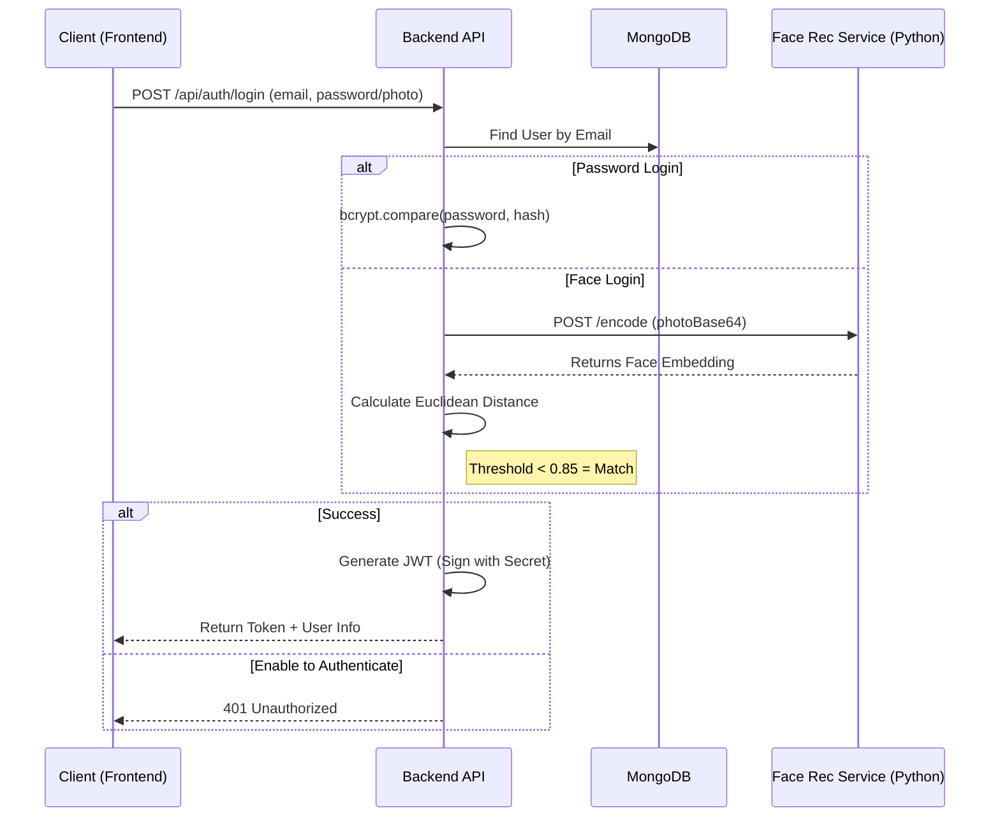
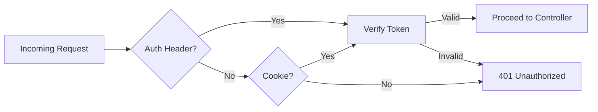

# Authentication & JWT Architecture

## 1. Overview
The authentication system secures API endpoints using JSON Web Tokens (JWT). It supports standard credential-based login as well as biometric Face Recognition login.

## 2. Authentication Flow

### 2.1 Login Sequence
The login process validates user credentials or biometric data and issues a signed JWT.

## 3. JWT Implementation

### 3.1 Token Generation
Tokens are signed using the HMAC SHA256 algorithm.
- Payload: Contains `id`, `email`, and `role`.
- Expiration: Set to 7 days (`7d`).
- Secret: Stored in `.env` (`JWT_SECRET`).

### 3.2 Token Storage
The token is sent to the client in two ways for maximum compatibility:
1.  **HTTP-Only Cookie**: `orbit_user` (Secure, SameSite=None).
2.  **JSON Response Body**: For non-browser clients or cross-domain failover.

## 4. Protected Routes (Middleware)
The `auth` middleware protects private routes.

### Workflow:
1.  **Extract Token**: Checks `req.cookies.orbit_user` OR `Authorization: Bearer <token>` header.
2.  **Verification**: Uses `jsonwebtoken.verify()` to decode the token.
3.  **Context**: Attaches decoded user data to `req.user`.
4.  **Error Handling**: Returns `401 Unauthorized` if token is missing or invalid.

## 5. Security Measures
- BCrypt: Passwords are hashed with salt before storage.
- Environment Variables: Secrets are never hardcoded.
- Cookie Security: `httpOnly` prevents XSS access, `secure` ensures HTTPS transmission.
