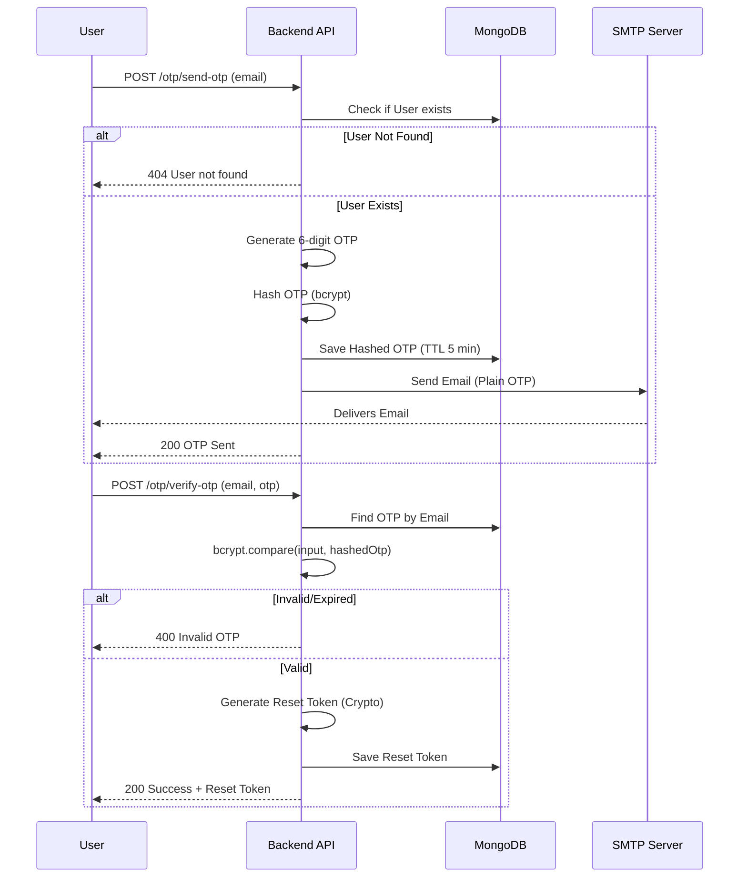

# OTP System Documentation

## 1. Overview
The OTP (One-Time Password) system handles secure password resets. It generates a numeric code, emails it to the user, and verifies it to issue a temporary reset token.

## 2. OTP Lifecycle

### 2.1 Generation
- Length: 6 digits.
- Algorithm: `Math.random()` scaled to range [100000, 999999].
- Hashing: The OTP is hashed using `bcrypt` before storage in the database for security.

### 2.2 Storage (`Otp` Model)
- Model: `models/otp.js`.
- TTL (Time To Live): 5 minutes (300 seconds) via MongoDB TTL index.
- Fields: `email`, `otp` (hashed), `createdAt`.

### 2.3 Email Dispatch
- Library: `nodemailer`.
- Service: Gmail SMTP (or configured provider).
- Template: HTML email with branding.

## 3. Workflow Diagram

## 4. API Endpoints

### 4.1 Send OTP
- Route: `POST /otp/send-otp`
- Controller: `controllers/otps/forgotpassword.js`
- Body: `{ "email": "user@example.com" }`

### 4.2 Verify OTP
- Route: `POST /otp/verify-otp`
- Controller: `controllers/otps/verifytOtp.js`
- Body: `{ "email": "user@example.com", "otp": "123456" }`
- Response: `{ "resetToken": "abc123..." }`

## 5. Security Features
- OTP Hashing: Even if the DB is compromised, raw OTPs are not visible.
- Short Expiry: OTPs are valid for only 5 minutes.
- Reset Token: Verification exchanges the OTP for a long, random crypto token for the actual password reset step, preventing OTP reuse.
