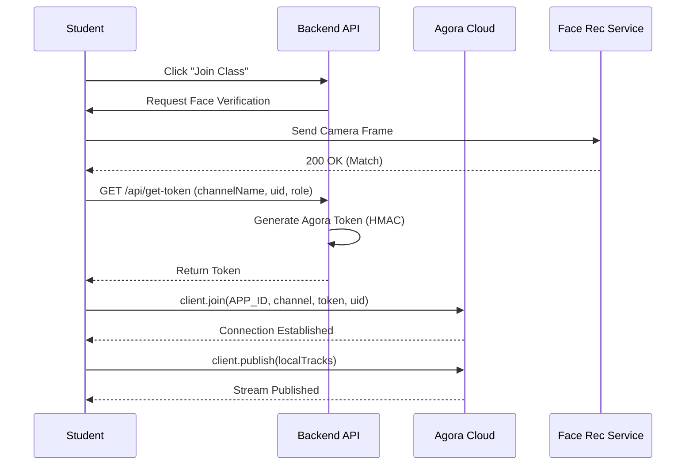

# Video Communication Architecture

## 1. Overview
The video communication module powers the virtual classroom experience. It uses the **Agora RTC SDK** for real-time video/audio and integrates with the backend for access token generation and face verification.

## 2. Key Components
- Client: `AgoraRTC_N-4.24.0.js` (Frontend SDK).
- Backend Token Server: Generates dynamic tokens using `agora-access-token`.
- Face Verification: Ensures only the registered student is attending.

## 3. Workflow Diagram (Join Process)

## 4. Implementation Details

### 4.1 Token Generation
To secure channels, clients must request a temporary token from the backend.
- Route: `GET /main/rtc-token` (or similar endpoint in `room.js`).
- Library: `RtcTokenBuilder` from `agora-access-token`.
- Validity: Tokens expire after a set duration (e.g., 1 hour).

### 4.2 Stream Management (`room_rtc.js`)
The `room_rtc.js` script manages the local and remote streams:
1.  **Initialize**: `AgoraRTC.createClient({ mode: "rtc", codec: "vp8" })`.
2.  **Local Stream**: `AgoraRTC.createMicrophoneAndCameraTracks()`.
3.  **Publish**: `client.publish([micTrack, camTrack])`.
4.  **Subscribe**: Listen for `user-published` event to render remote users.

### 4.3 Feature: Camera Off Placeholder
When a user turns off their camera, a `userMuteVideo` event is triggered.
- Logic: The UI hides the video element and shows a profile placeholder (avatar).
- Function: `handleRemoteMuteVideo(user, muted)`.

## 5. Security
- Dynamic Tokens: Prevents unauthorized access to classrooms.
- Face Guard: Verifies identity before allowing entry.
- Role-Based: Host (Faculty) vs Audience (Student) permissions.
