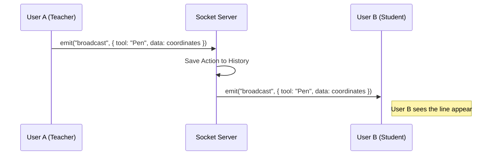

# Real-time Infrastructure (Socket.io)

## 1. Overview
The platform uses **Socket.io** to enable low-latency, bidirectional communication between clients and the server. This is primarily used for the **Interactive Whiteboard** and **Collaborative Tools**.

## 2. Architecture
- Library: `socket.io` (Server), `socket.io-client` (Client).
- Transport: WebSockets (with Polling fallback).
- Namespace: Default namespace `/` (or specific namespaces if configured).
- Proxy: `/wbo` requests are proxied to a dedicated Whiteboard process running on port 5001.

## 3. Whiteboard Synchronization (`whiteboard/server/sockets.js`)
The whiteboard logic ensures that drawing strokes, images, and cursor movements are synchronized across all connected users in a class.

### 3.1 Key Events
- `connection`: Triggered when a user opens the whiteboard.
- `joinboard`: User requests to join a specific board (Room).
- `getboard`: User requests the full history of the board (to sync state upon joining).
- `broadcast`: User sends an action (draw, erase) to be replicated to others.
- `disconnecting`: User leaves; cleanup logic runs.

### 3.2 Data Flow Diagram

## 4. Whiteboard Room Logic
Boards are treated as dynamic "Rooms".
- Dynamic Creation: A board is loaded into memory (`boards` object) upon the first user joining.
- Memory Management: When the last user disconnects, the board is saved to disk and unloaded from memory to save resources.
- Throttling: The server implements rate limiting (`MAX_EMIT_COUNT`) to prevent spamming or flooding attacks.

## 5. Security
- Input Validation: The `broadcast` handler filters blocked tools and malformed messages.
- JWT Auth: Socket handshake can handle authentication tokens (`socket.handshake.query.token`) to verify user identity before connection.
