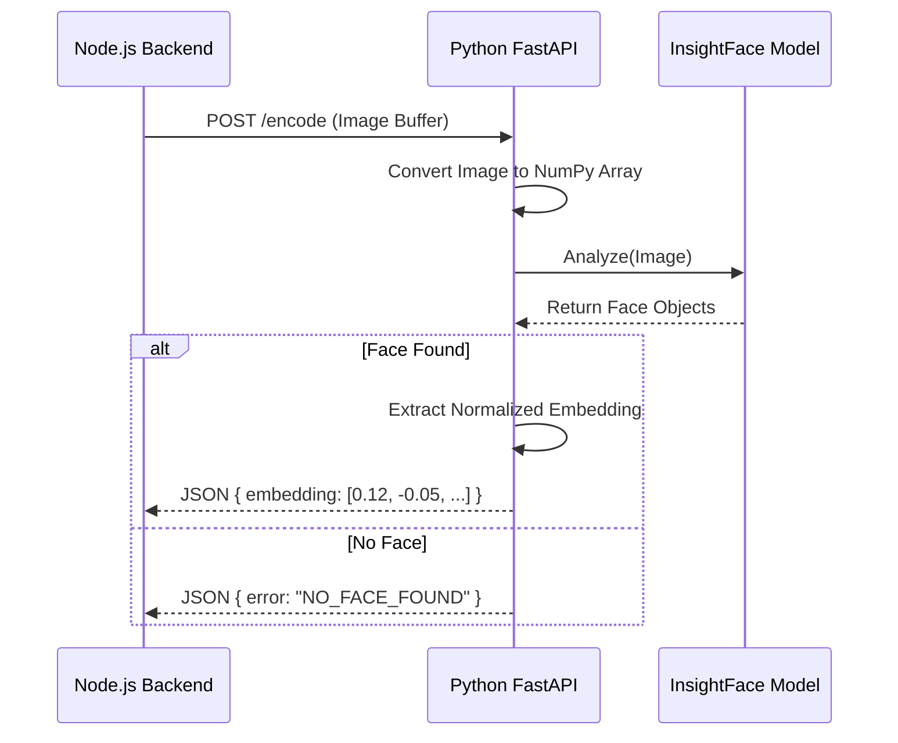

# Python AI Service Architecture

## 1. Overview
The project offloads computationally intensive AI tasks to a dedicated Python microservice. This service is built with **FastAPI** and communicates with the Node.js backend via HTTP/REST.

## 2. Tech Stack
- Framework: FastAPI (High-performance web framework).
- AI Library: InsightFace (State-of-the-art face analysis).
- Model: `buffalo_l` (Lightweight yet accurate face detection/recognition model).
- Execution: `subprocess` (For compiling user code securely).

## 3. Core Components (`app.py`)

### 3.1 Face Recognition Engine
- **Initialization**: Loads models into memory at startup (`lifespan` handler) to prevent latency on requests.
- **Endpoint**: `POST /encode`
- **Logic**:
    1.  Receives an image (UploadFile).
    2.  Converts bytes to NumPy array.
    3.  runs `_face_analyzer.get(arr)` to detect faces.
    4.  Extracts the **128-dimensional embedding vector**.
    5.  Returns the embedding to Node.js for comparison.

### 3.2 Code Compiler API
- Endpoint: `POST /api/compiler/execute`
- Supported Languages: Python, Java, C, C++.
- Security: Uses `CodeExecutor` class to run user code in isolated subprocesses with strict timeouts to prevent infinite loops or system attacks.

## 4. Interaction Diagram (Face Login)

## 5. Deployment Considerations
- Azure App Service: The Python service is deployed on Azure.
- Cold Start: The `lifespan` manager ensures models are fully loaded before accepting the first request.
- Persistence: Usage of `HOME` env var to store model weights persistently across restarts.
