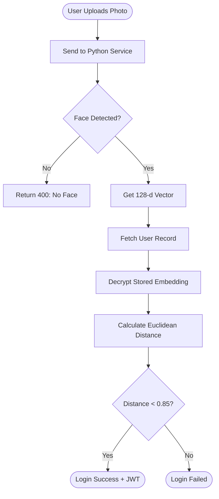

# Face Recognition System

## 1. Introduction
The Face Recognition system provides biometric authentication ensuring high security for logins and classroom attendance. It uses a **hybrid architecture** combining Node.js (Orchestrator) and Python (AI Engine).

## 2. Core Logic

### 2.1 Embedding Generation
- Model: `insightface.app.FaceAnalysis` (Buffalo_L model).
- Input: Base64 encoded JPEG/PNG image.
- Output: A 128-dimensional floating-point vector (normalized).

### 2.2 Comparison Algorithm
- Method: Euclidean Distance.
- Formula: $\sqrt{\sum (v1_i - v2_i)^2}$
- Threshold: 0.85 (Empirically determined for optimal balance between False Positives and False Negatives).
    - Distance < 0.85: Match
    - Distance > 0.85: No Match

### 2.3 Security (Encryption)
To protect biometric data, face embeddings are **NOT** stored as raw JSON arrays in the database.
- Encryption: AES-256-CBC.
- Key: Derived from `embeddingCrypto.js` util.
- Storage: Encrypted string in `User.faceEmbedding`.

## 3. Detailed Workflow (Login)

## 4. Integration Points
- Signup: Capture reference face, encrypt, and store.
- Login: Biometric alternative to password.
- Video Call: Continuous verification or entry-check to prevent proxy attendance.

## 5. Performance
- Latency: ~200-500ms for encoding on Azure Basic Plan.
- Optimization: Python service keeps models loaded in RAM (`lifespan` event) to avoid cold-start delays.
