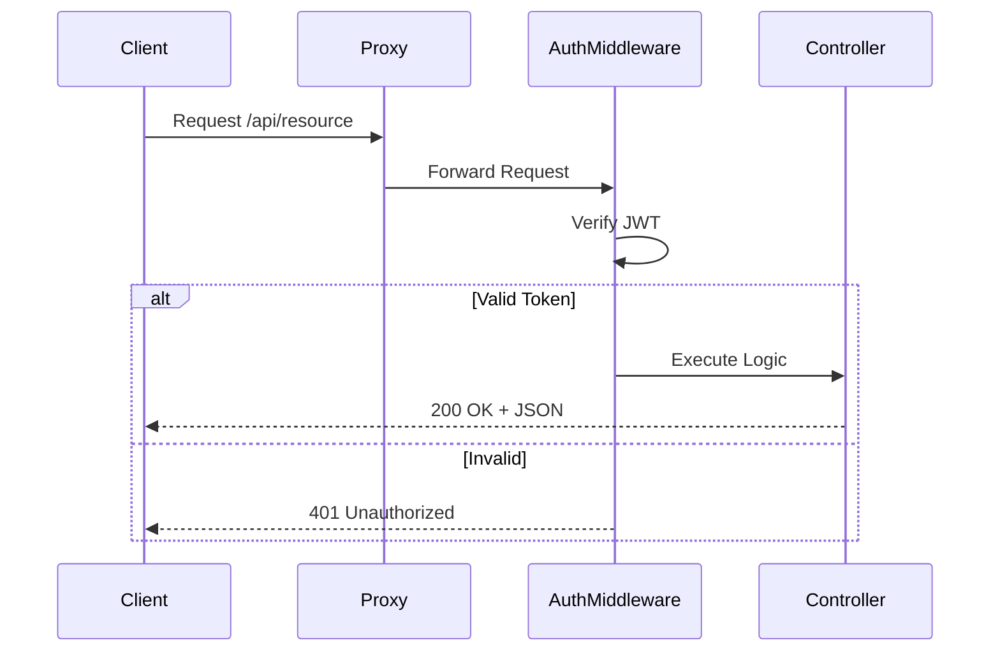

# API Reference Guide

## 1. Authentication (`/api/auth`)

| Method | Endpoint | Description | Auth Required |
| :--- | :--- | :--- | :--- |
| `POST` | `/login` | Login user with email/password or face | No |
| `POST` | `/signup` | Register new user | No |
| `GET` | `/check-auth` | Verify current session token | Yes |
| `POST` | `/logout` | Clear session cookie | Yes |

## 2. Class Management (`/api/class`)

| Method | Endpoint | Description | Auth Required |
| :--- | :--- | :--- | :--- |
| `POST` | `/create` | Create a new classroom | Yes (Faculty) |
| `POST` | `/join` | Student join class with code | Yes (Student) |
| `GET` | `/my-classes` | List enrolled/teaching classes | Yes |
| `POST` | `/schedule` | Add class schedule | Yes (Faculty) |

## 3. Video & Sessions (`/api/openclass`, `/api/sessions`)

| Method | Endpoint | Description | Auth Required |
| :--- | :--- | :--- | :--- |
| `POST` | `/start` | Start a video session (Faculty) | Yes |
| `GET` | `/token` | Get Agora RTC token | Yes |
| `POST` | `/verify-face` | Verify student face before joining | Yes |

## 4. OTP & Password Reset (`/otp`)

| Method | Endpoint | Description | Auth Required |
| :--- | :--- | :--- | :--- |
| `POST` | `/send-otp` | Trigger OTP email | No |
| `POST` | `/verify-otp` | Verify OTP code | No |
| `POST` | `/reset-password` | Set new password with token | No |

## 5. AI Services (`/api`)

| Method | Endpoint | Description | Auth Required |
| :--- | :--- | :--- | :--- |
| `POST` | `/analyze-code` | Get AI analysis of code snippet | Yes |
| `POST` | `/compile` | Compile and run code | Yes |

## 6. Diagram: Request Flow

