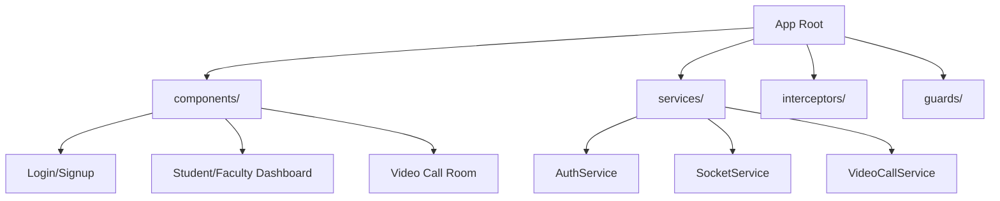

# Frontend Architecture (Angular)

## 1. Overview
The frontend is a Single Page Application (SPA) built with **Angular 17+**. It features a modern, responsive UI with real-time capabilities via Socket.io and Agora.

## 2. Tech Stack
- Framework: Angular (TypeScript)
- Styling: Tailwind CSS
- State Management: RxJS (Observables)
- Real-time: `socket.io-client`
- Video: `agora-rtc-sdk-ng`
- Face AI: `face-api.js` (Client-side pre-check)

## 3. Folder Structure (`src/app`)

## 4. Key Services

### 4.1 AuthService
Manages user sessions, stores JWT in local state (for UI updates), and handles login/logout logic.

### 4.2 SocketService
A singleton service that maintains the WebSocket connection.
- Methods: `connect()`, `emit()`, `listen()`.
- Logic: Handles reconnection automatically if the network drops.

### 4.3 WebRTCService
Wraps the Agora SDK to provide a clean API for components to join channels and publish streams.

## 5. Routing Strategy
The app uses **Lazy Loading** to improve performance. Modules like `Dashboard` and `VideoCall` are only loaded when the user navigates to them.

## 6. Security
- AuthGuard: Prevents access to `/dashboard` or `/class/:id` without a valid token.
- RoleGuard: Restricts Faculty-only pages (e.g., "Create Class") from Students.
