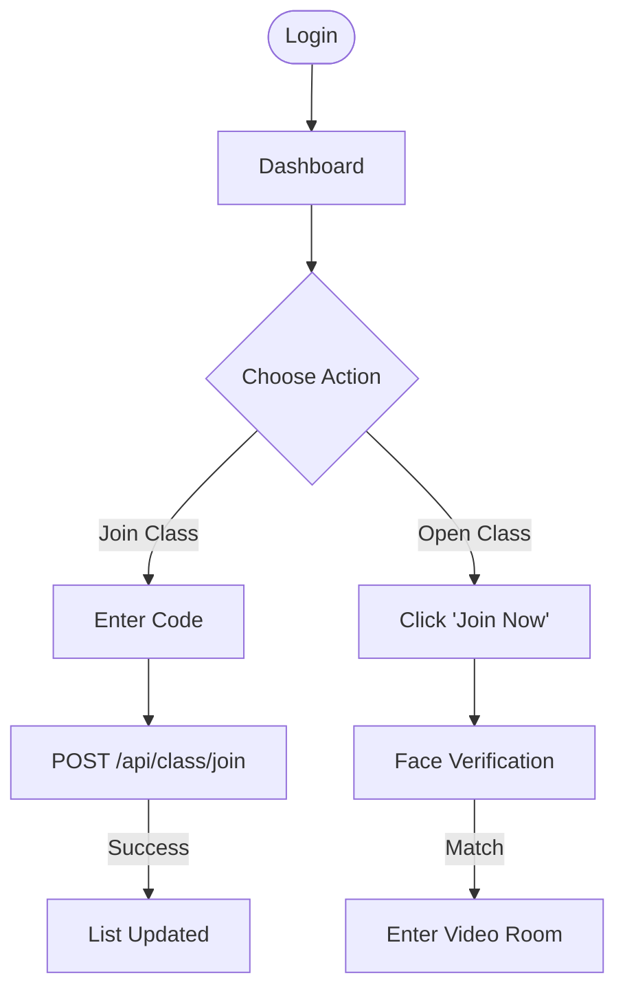

# Student Dashboard Documentation

## 1. Overview
The Student Dashboard is the central hub for learners. It focuses on accessibility, quick joining of classes, and tracking progress.

## 2. Key Features
- Join Class: Enter a 6-character code to enroll in a new course.
- My Classes: Grid view of all enrolled subjects.
- Attendance: Visualization of attendance records.
- Profile: Manage account settings and face data.

## 3. Workflow Diagram (Join Class)

## 4. Component Structure
- `StudentDashboardComponent`: Main container.
- `ClassCardComponent`: Reusable card for displaying class info.
- `JoinClassModal`: Popup for code entry.

## 5. API Integration
- `GET /api/classes/student`: Fetches enrolled classes.
- `GET /api/attendance/:id`: Fetches attendance stats.
