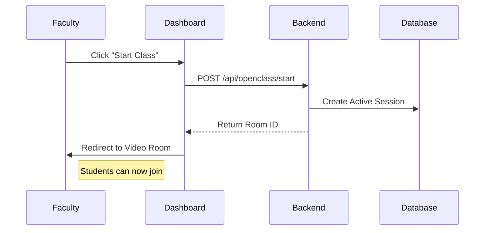

# Faculty Dashboard Documentation

## 1. Overview
The Faculty Dashboard provides tools to manage classrooms, schedule sessions, and monitor student engagement.

## 2. Key Features
- Create Class: Generate new courses with unique codes.
- Schedule Class: Set recurring or one-time sessions.
- Start Class: Instant button to open the video room.
- Analytics: View attendance reports and engagement metrics.

## 3. Workflow Diagram (Start Class)

## 4. Component Structure
- `FacultyDashboardComponent`: Main layout.
- `CreateClassComponent`: Form for new classes.
- `SchedulerComponent`: Calendar interface.

## 5. Unique Functionality
- Dynamic Code Generation: Automatically generates a 6-char unique code upon class creation.
- Session Tracking: Automatically logs session start/end times for payroll/attendance.
