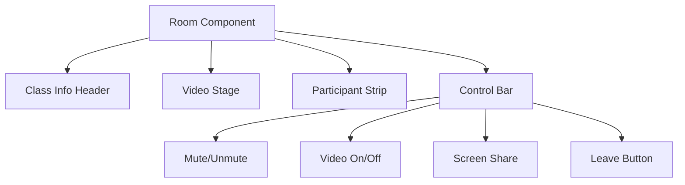

# Video Call Interface Documentation

## 1. Overview
The Video Call Interface is the core classroom experience. It combines real-time video, chat, and collaborative tools into a single, immersive view.

## 2. UI Layout
The interface is divided into three main sections:
1.  Main Stage: Display for the active speaker or shared screen.
2.  Participant Grid: Scrollable list of student video feeds (Top/Side).
3.  Control Bar: Buttons for mute, camera, screen share, and leave.

## 3. Key Features
- Video Grid: Auto-adjusts layout based on participant count.
- Active Speaker Detection: Highlights the current speaker.
- Screen Sharing: Faculty can share their screen or specific windows.
- Chat: Real-time text chat side-panel.
- Whiteboard: Collaborative canvas overlay.

## 4. Component Diagram

## 5. User Experience (UX) Flow
1.  Entry: User clicks "Join", passes Face Check, lands in "Lobby".
2.  Lobby: Preview camera/mic, set display name.
3.  Room: Main session.
4.  Exit: "Leave" button redirects to Dashboard + Analytics summary.
