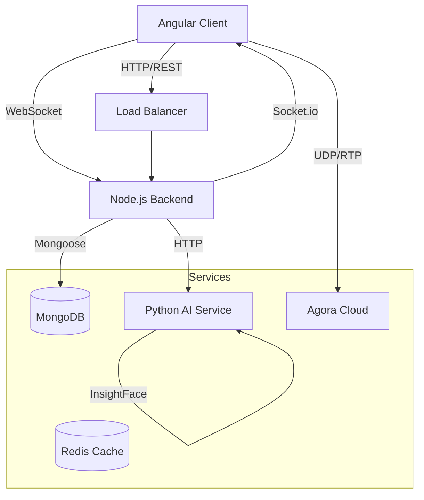

# Master System Architecture

## 1. Executive Summary
ORBIT is an AI-powered virtual classroom platform designed to deliver secure, interactive, and attendance-tracked learning experiences. It leverages modern web technologies (MEAN stack) combined with specialized microservices for AI and Real-time communication.

## 2. High-Level Architecture

## 3. Technology Stack

| Layer | Technology | Purpose |
| :--- | :--- | :--- |
| Frontend | Angular 17, TailwindCSS | User Interface, SPA Logic |
| Backend | Node.js, Express.js | API, Auth, Orchestration |
| Database | MongoDB, Mongoose | Data Persistence |
| AI Service | Python, FastAPI, InsightFace | Face Recognition, Code Compilation |
| Real-time | Socket.io | Whiteboard, Chat, Signaling |
| Video | Agora RTC SDK | Low-latency Video/Audio |
| Infrastructure | Docker, Render, Vercel | Deployment, Hosting |

## 4. Key Workflows

### 4.1 Secure Login (Bio-Auth)
1.  User submits photo.
2.  Python AI generates embedding.
3.  Node.js compares with stored vector (Encrypted).
4.  If match > 85%, JWT issued.

### 4.2 Class Session
1.  Faculty starts class -> Room created.
2.  Students join -> Face Verified -> Token issued.
3.  Video connection established (P2P/SFU via Agora).
4.  Attendance logged automatically.

## 5. Security Architecture
- Data at Rest: AES-256 for biometric data.
- Data in Transit: SSL/TLS (HTTPS/WSS) for all traffic.
- Access Control: Role-Based Access Control (RBAC) via JWT.
- Infrastructure: Rate limiting, CORS policies, Input validation.

## 6. Scaling Strategy
- Microservices: Decomposing AI and Whiteboard into separate services allow independent scaling.
- Stateless Backend: REST APIs are stateless, enabling horizontal scaling behind a load balancer.
- CDN: Static assets served via CDN (Vercel Edge Network).
